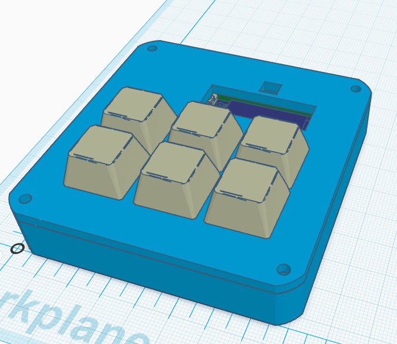
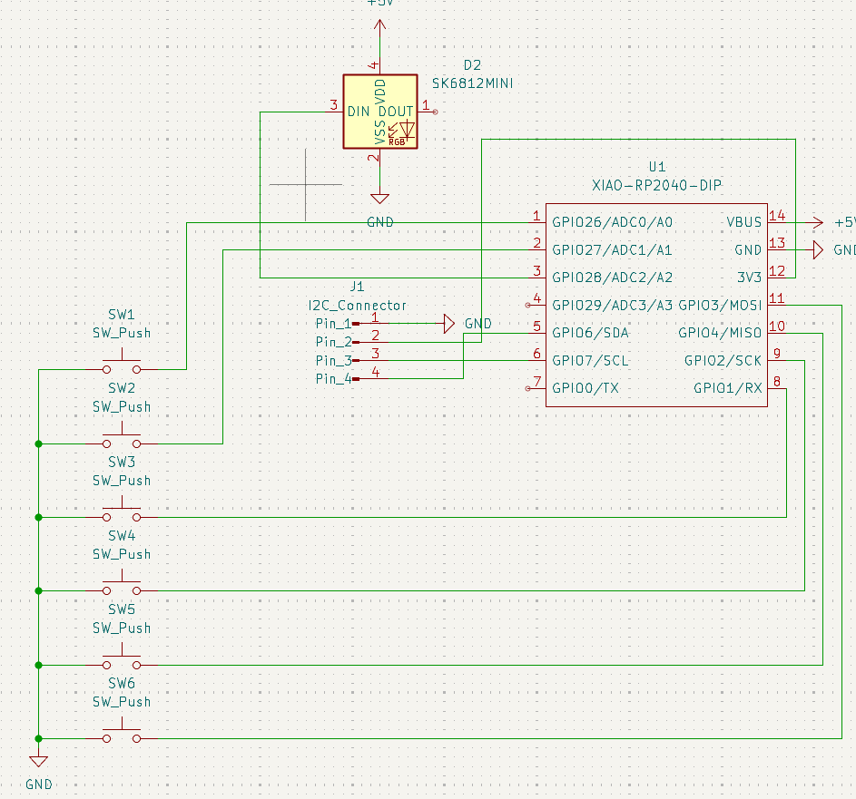
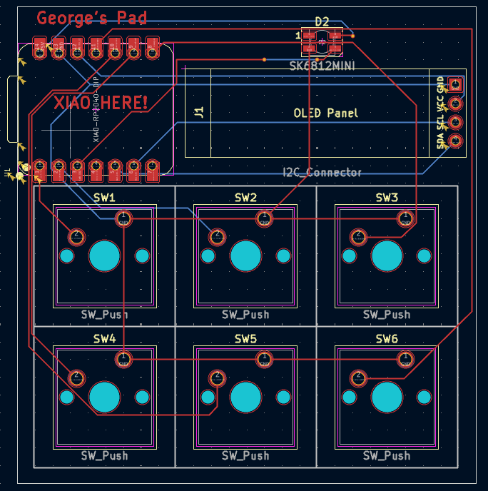
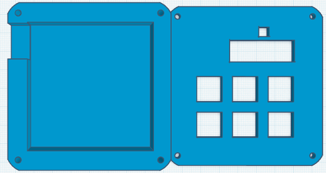

# George's Hackpad
After many hours of work I finally put everything together in what I hope is a functional hackpad. (A better picture will be added once everything is assembled)
  

### Inspiration
I recently learned about the blueprint program and decided it was the perfect way to gain some experience actually building stuff.

### Challenges
This was the first PCB I have ever designed (which is probably obvious from the wiring). Getting the software to work and learning the fundamental aspects of PCB design was challenging but thankfully my previous knowledge helped me overcome any problems.

### Firmware
After reading a lot of documentation this is what I came up with. Now obviously I can't test the code since I don't have anything similar so as soon as everything is assembled I will test, bug fix and upload the new code with any corrections that were made.

BOM: 
- 6x Cherry MX Switches
- 1x SK6812 MINI LED
- 1x XIAO RP2040
- 6x Blank DSA Keycaps
- 1x 3.3V I2C 0.91 Inch OLED Display

Others:
- Top Case.stl 
- Bottom Case.stl
- 4x 3D Printed Cylinders

Schematic            |  PCB         |   Case
:-------------------------:|:-------------------------:|:-------------------------:|
    |    |    